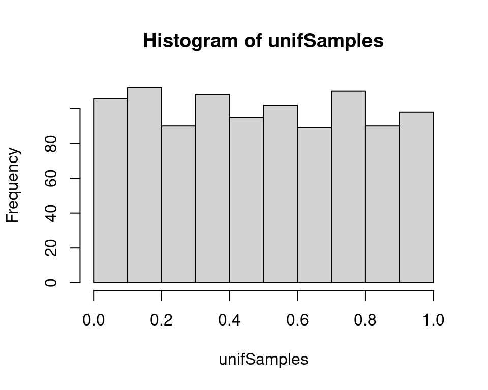
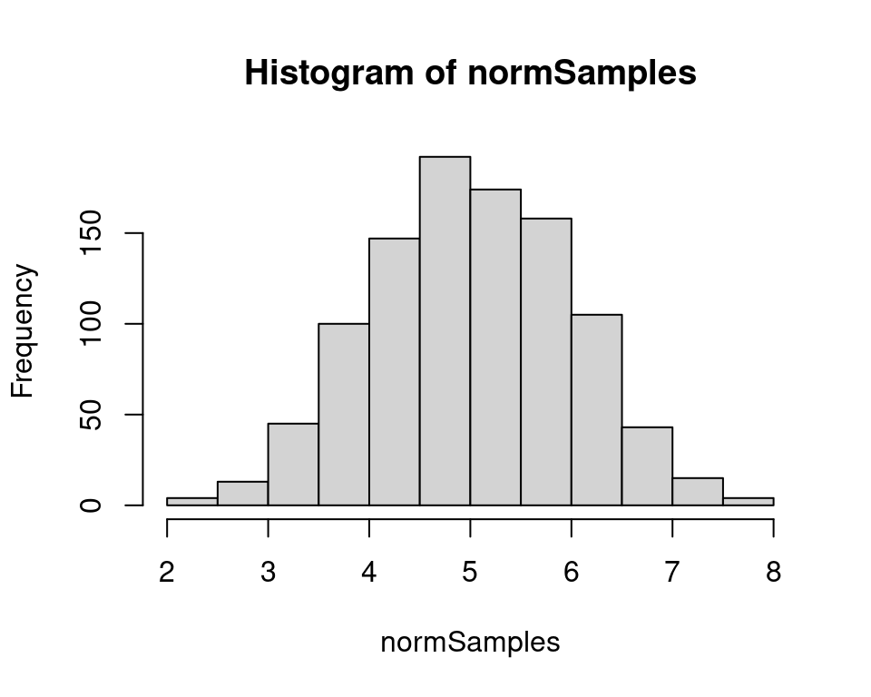
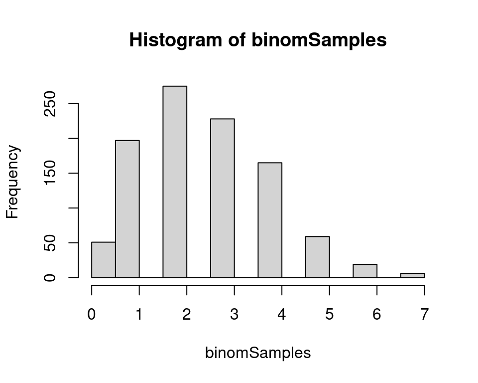
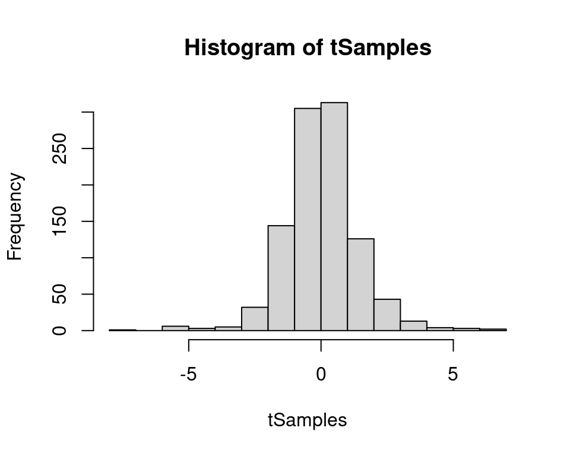
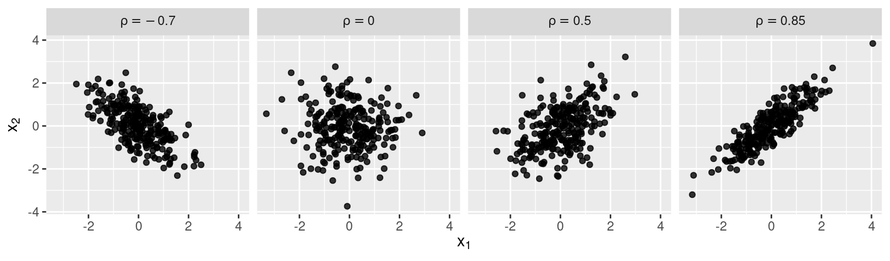
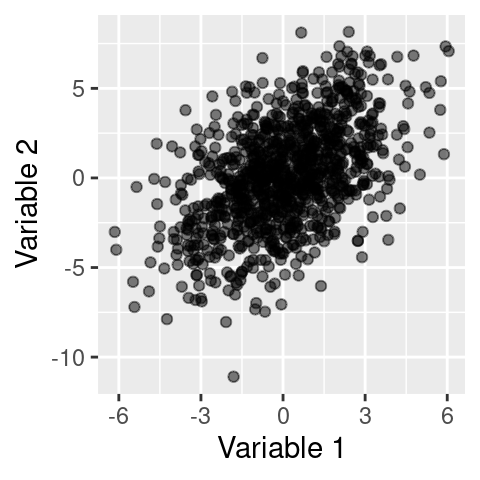

::: {.cell}

:::


## Power Analysis: basic concepts

- **Statistical Power:** Probability that a test correctly rejects a false null hypothesis.
- **Effect Size:** Quantitative measure of the magnitude of an effect; it can be standardised (e.g. Cohen's $d$) or not. 


## 


::: {.cell layout-align="center"}
::: {.cell-output-display}
{fig-align='center' width=921.6}
:::
:::


::: {style="font-size: 70%;"}

| Notation  | Meaning                                                                                          |
|:---------:|:------------------------------------------------------------------------------------------------|
| $\beta$   | Probability of a Type II error (false negative)                                                 |
| $1-\beta$ | Probability of a true positive (correctly rejecting the null hypothesis), or **statistical power** |
| $\alpha$  | Probability of a Type I error (false positive)                                                  |
| $1-\alpha$| Probability of a true negative (correctly not rejecting the null hypothesis)                    |

:::


## How to compute statistical power

- For simple tests (e.g. correlations, t-tests), power can be computed analytically (e.g. using the `pwr` package in R).
- More complex designs are often easier to handle using simulation-based approaches.
- Simulations allow us to define a _ground truth_ against which to evaluate a study design.
- Crucially, simulations can incorporate realistic features of both data collection (e.g. attrition, missing data) and inference (e.g. multilevel models, or requiring multiple effects to be significant simultaneously).

## Simulation approach in 1 figure

 

{.nostretch fig-align="center" width="70%"}

##

### Simulation approach in simple linear models (regression, ANOVA)


::::::::: columns
::::::: {.column width="80%"}

::: nonincremental


- Chapter 6 of [our book](https://www.mheducation.co.uk/statistics-for-psychology-using-r-a-linear-models-perspective-9780335252626-emea-group) (available in the Library)


- This prior training seminar: [link](https://mlisi.xyz/RHUL-stats/workshops.html#power-analyses-via-data-simulation) 

:::

:::: fragment

<iframe
  src="https://mlisi.xyz/files/workshops/power_analyses/power_analyses.html#75"
  style="width:80%; height:50vh; border:none;">
</iframe>

::::

:::::::

::::::: {.column width="20%"}

{.nostretch fig-align="center" width="100%"}

:::::::
:::::::::


## Basics of data simulation {class="inverse"}

- R has some useful functions for generating data randomly drawn from different distributions.

- Random generation functions usually have the `r` prefix, for example:
  - `rnorm()` for the normal distribution
  - `rbinom()` for the binomial distribution

- To see all distributions available in the `stats` package (included in R installation by default) type `?Distributions`

##

:::: columns
::: {.column width="50%"}

Uniform distribution from 0 to 1


::: {.cell layout-align="center"}

```{.r .cell-code}
N <- 1000
unifSamples <- runif(N, min = 0, max = 1)
hist(unifSamples)
```

::: {.cell-output-display}
{fig-align='center' width=480}
:::
:::


:::

::: {.column width="50%"}

Normal distribution with mean 5 and standard deviation 1


::: {.cell layout-align="center"}

```{.r .cell-code}
normSamples <- rnorm(N, mean = 5, sd = 1)
hist(normSamples)
```

::: {.cell-output-display}
{fig-align='center' width=480}
:::
:::


:::
::::

##

:::: columns
::: {.column width="50%"}

Binomial distribution, 10 trials with success probability 0.25


::: {.cell layout-align="center"}

```{.r .cell-code}
binomSamples <- rbinom(N, size = 10, prob = 0.25)
hist(binomSamples)
```

::: {.cell-output-display}
{fig-align='center' width=480}
:::
:::


:::

::: {.column width="50%"}

Student’s t distribution with 4 degrees of freedom


::: {.cell layout-align="center"}

```{.r .cell-code}
tSamples <- rt(N, df = 4)
hist(tSamples)
```

::: {.cell-output-display}
{fig-align='center' width=480}
:::
:::


:::
::::

## Ordinal variables

Ordinal variables can be simulated with the `rmultinom()`, but we need to ensure that the probabilities (the parameters of the multinomial distribution) are allocated in a way that is consistent with the analysis model. See example at [mlisi.xyz/RHUL-stats/ordinal.html](https://mlisi.xyz/RHUL-stats/ordinal.html) for simulating a multilevel ordinal logistic model.

::: fragment

<iframe
  src="https://mlisi.xyz/RHUL-stats/ordinal.html"
  style="width:100%; height:80vh; border:none;"
  scrolling="yes">
</iframe>


:::

## Simulating Multivariate Normal Data


::: {.cell layout-align="center"}
::: {.cell-output-display}
{fig-align='center' width=816}
:::
:::


- To simulate multiple variables, we must specify not only their marginal properties (e.g. means and SD) but also how they are correlated.

- Particularly important for longitudinal or repeated-measures designs, where observations from the same participant are typically correlated.

- In multilevel (mixed-effects) models person-specific effects (random effects, interpreted as _latent, individual-level characteristics_) follow a multivariate normal distribution.


##

**Example: 2 correlated normal variables:**

:::: columns
::: {.column width="50%"}

*Define standard deviations and correlations*

::::: nonincremental

- $\sigma_1$ and $\sigma_2$: standard deviations
- $\rho$: correlation

:::::


::: {.cell}

```{.r .cell-code}
sigma1 <- 2
sigma2 <- 3
rho <- 0.5
```
:::


:::


::: {.column width="50%"}

:::::: fragment

*Construct the 2×2 variance–covariance matrix*

$$\mathbf{\Sigma} = \left[ \begin{array}{cc} \sigma_1^2 & \sigma_1 \sigma_2 \rho \\ \sigma_1 \sigma_2 \rho & \sigma_2^2 \end{array} \right]$$


::: {.cell}

```{.r .cell-code}
sigma <- matrix(
  c(sigma1^2,
    rho * sigma1 * sigma2,
    rho * sigma1 * sigma2,
    sigma2^2),
  ncol = 2, 
  nrow = 2)

print(sigma)
```

::: {.cell-output .cell-output-stdout}

```
     [,1] [,2]
[1,]    4    3
[2,]    3    9
```


:::
:::


::::::

:::

::::


##

:::: columns
::: {.column width="50%"}

Multivariate normal data can then be simulated with `mvrnorm()` (in the `MASS` package)


::: {.cell}

```{.r .cell-code}
library(MASS)
data <- mvrnorm(N,
          mu = c(0, 0),
          Sigma = sigma)

head(data)
```

::: {.cell-output .cell-output-stdout}

```
            [,1]       [,2]
[1,] -2.28712046 -5.7925998
[2,]  1.94622405 -1.0715909
[3,] -1.38990532 -4.6613096
[4,]  0.09676132 -0.6099499
[5,] -2.33520863 -2.4852549
[6,] -2.12968476  0.5224903
```


:::
:::


:::


::: {.column width="50%"}


::: {.cell layout-align="center"}

```{.r .cell-code}
ggplot(as.data.frame(data), 
       aes(x = V1, 
           y = V2)) +
  geom_point(alpha = 0.5) +
  labs(x = "Variable 1", 
       y = "Variable 2")
```

::: {.cell-output-display}
{fig-align='center' width=240}
:::
:::


:::

::::

## Simulation without a parametric model

:::: {style="font-size: 75%;"}

Background: 

> _The paper tests whether linguistic measures of surprisal capture attention using a new synchronised tapping task we developed. Participants tap to the beat of a click track while ignoring continuous speech (an audiobook). A decoder is then trained to predict different speech features based on changes in participant’s tapping asynchrony (difference between tap and click time). One outcome measure is the coefficient (in this case Spearman’s rho) representing the correlation between predicted and observed speech features._ 

> _To obtain the null distribution of r-values, we shuffled the tapping data and re-ran the analysis 1000 times. The p-value is the proportion of null r-values that are >= than the median observed r-value._ 

::::

::: {style="font-size: 55%;"}

(Courtesy of Ashley Symons)

:::

 

:::: {style="font-size: 75%;"}

- The editor asked for an experiment, with sample size determined by a power analysis.
- No parametric model assumed for tapping behaviour.
- It is possible to run simulations by _bootstrapping_ (sampling _with replacement_) available data.
- Smaller effect sizes can be simulated by setting a small probability that each bootstrapped tapping sequence is replaced with a shuffled version.

::::


## Worked examples

Link: (mlisi.xyz/power-sim-workshop/)[https://mlisi.xyz/power-sim-workshop/]

1. GLMM
2. Experience sampling study

