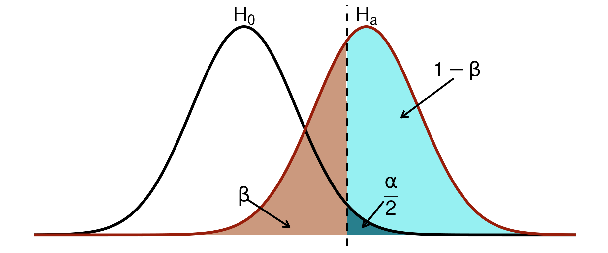
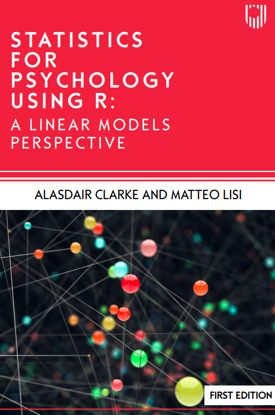

::: {.cell}

:::

## Power Analysis: basic concepts

- **Statistical Power:** Probability that a test correctly rejects a false null hypothesis.
- **Effect Size:** Quantitative measure of the magnitude of an effect; it can be standardised (e.g. Cohen's $d$) or not. 

## 

::: {.cell layout-align="center"}
::: {.cell-output-display}
{fig-align='center' width=921.6}
:::
:::

::: {style="font-size: 70%;"}

| Notation  | Meaning                                                                                          |
|:---------:|:------------------------------------------------------------------------------------------------|
| $\beta$   | Probability of a Type II error (false negative)                                                 |
| $1-\beta$ | Probability of a true positive (correctly rejecting the null hypothesis), or **statistical power** |
| $\alpha$  | Probability of a Type I error (false positive)                                                  |
| $1-\alpha$| Probability of a true negative (correctly not rejecting the null hypothesis)                    |

:::

## How to compute statistical power

- For simple tests (e.g. correlations, t-tests), power can be computed analytically (e.g. using the `pwr` package in R).
- More complex designs are often easier to handle using simulation-based approaches.
- Simulations allow us to define a _ground truth_ against which to evaluate a study design.
- Crucially, simulations can model realistic features of data collection (e.g. attrition, missing data, non-ideal assumptions).

## Simulation approach in 1 figure

 

{.nostretch fig-align="center" width="70%"}

##

### Simulation approach in simple linear models (regression, ANOVA)

 

::::::::: columns
::::::: {.column width="75%"}

::: nonincremental

 

- Chapter 6 of [my book](https://www.mheducation.co.uk/statistics-for-psychology-using-r-a-linear-models-perspective-9780335252626-emea-group) (available in the Library)

 

- This prior training seminar: [link](https://mlisi.xyz/RHUL-stats/workshops.html#power-analyses-via-data-simulation) 
:::

:::::::

::::::: {.column width="25%"}

{.nostretch fig-align="center" width="100%"}

:::::::
:::::::::

